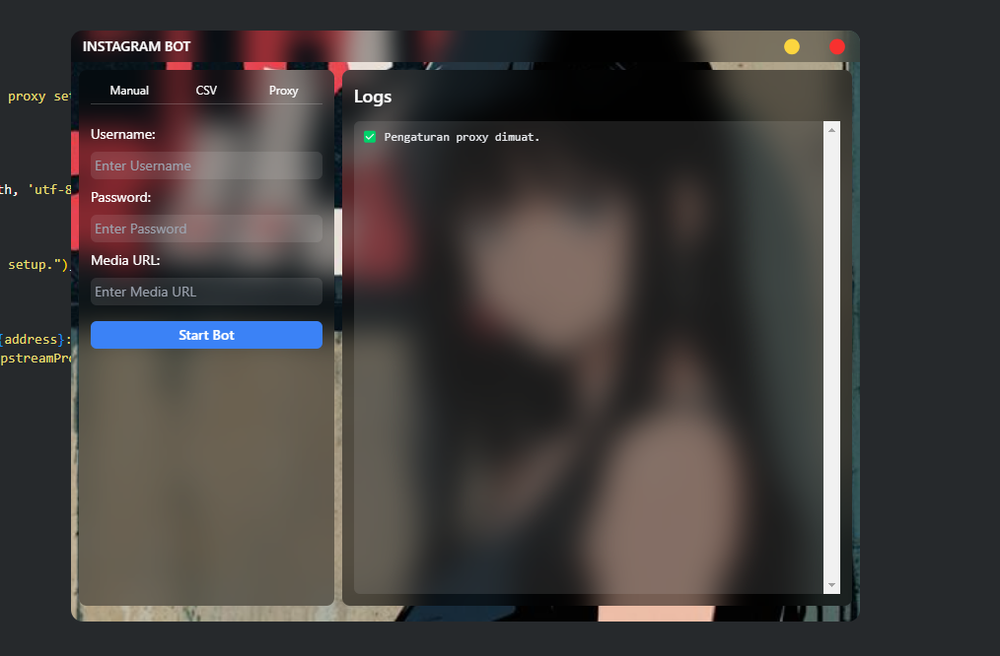

# Instagram Auto Followers


simple, desktop based Instagram Auto Follow by media POST


# installation

- Node JS LTS +

# Run 
 Running from source :

```bash
> git clone https://github.com/fdciabdul/Instagram-Auto-Follow
> cd Instagram-Auto-Follow
> npm install
> npm start
```
 ### building 

 ```bash
> npm run dev
```

the executable file will be served at `dist` folder


# Want another automation Project ?


hire me : https://projects.co.id/public/browse_users/view/496e26/fdciabdul
